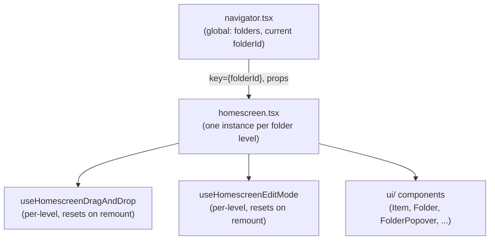

# Homescreen Refactor Plan (WIP — delete once landed)

Working doc for the Manager/Homescreen restructure discussed in chat. High-level only,
not a spec — see `BEHAVIOR.md` for intended behavior, this is about code shape.

## Concept shift

- **Now:** one persistent `Homescreen` instance for the app's lifetime. Navigating just
  feeds it different data (`visibleElements`/`folderPath`) via context. No component
  identity change on navigation.
- **New:** `Homescreen` becomes a component scoped to *one folder level*
  (`<Homescreen folderId={x} key={x}/>`). "Manager" becomes a **navigator**: owns which
  folder is currently active, mounts/remounts the Homescreen for it.
- Why: matches the original mental model (a folder *is* a Homescreen), gets us
  remount-on-navigate for free via React's `key`, and opens the door to showing a
  folder's Homescreen in a **popup instead of full-screen navigation** (deferred
  earlier because popup-editing is harder than full-screen — revisit once full-screen
  works cleanly).

## Target shape

```
app/components/homescreen/
  navigator.tsx                 (was homescreen-manager.tsx)
                                 owns: folders (whole tree), navigation stack
                                 renders: <Homescreen key={folderId} folderId={..} folders={..}/>
                                 maybe renders it inside a Modal instead, later

  homescreen.tsx                 per-level component (remounts on folderId change)
                                 composes the per-level hooks below, renders the grid

  useHomescreenNavigation.ts     used BY navigator, not per-level
  useHomescreenDragAndDrop.ts    per-level (exists)
  useHomescreenEditMode.ts       per-level (new)
  (popups, create-flow: TBD, likely per-level)

  ui/    crud/    util.ts    types.tsx    constants.tsx   <- unchanged
```



Remounting `homescreen.tsx` on navigation is what makes drag state and edit-mode
"per-level" for free — no manual reset logic needed, React does it via `key`.

## What's global vs. per-level

Needs to be explicit now, wasn't before:

- **Global** (lives in the navigator, survives remounts): `folders` (the whole tree —
  can't reset when you enter a folder), the navigation stack itself.
- **Per-level** (lives inside each Homescreen instance, resets on remount): drag state
  (already is, via the hook), **edit mode** (confirmed: should always be local, easy to
  re-activate per level — not global like it is today).
- Undecided / needs a decision when we get there: popups, create-flow FAB state —
  probably per-level too, but not settled.

## Hooks to extract from Manager (each usable standalone)

- `useHomescreenDragAndDrop` — done.
- `useHomescreenNavigation` — currentLevel, folderPath, back button, onFolderTap.
  Lives in the **navigator**, not per-level (it's what decides the level).
- `useHomescreenEditMode` — per-level, resets on remount, no cross-level state needed.
- popups, create-flow — TBD, probably per-level hooks too.

## mountKey hack

- Eliminate. Remounting via `key={folderId}` should cover the "entering a folder resets
  everything" case that part of the hack was working around.
- Doesn't automatically cover in-level forced remounts after drag mutations — root cause
  those separately (why isn't a normal re-render enough there?) before assuming `key`
  fixes everything.

## Open / unresolved

- Popup presentation mode (folder-as-modal) — not started, revisit after full-screen
  nav is solid on the new structure.
- Exact hook boundaries for popups/create-flow.
- Whether `Homescreen` still needs a separate `HomescreenManager` component + Context,
  or whether the navigator can just render `<Homescreen key={folderId} .../>` directly
  with props instead of context, now that the reason for a shared single instance is gone.
